# Loyalty Entities And Query Patterns

**Billing:** One canonical `BILL` entity owned by the backend (`tangify_bills`). The POS previously used local `TBill` in localforage and GitHub Gist invoice numbers because the backend was not ready — that is **transitional UI only** and will be replaced by backend APIs. Payment preview state may live in UI memory; the authoritative bill is created/closed on the server.

```mermaid
erDiagram
    STAFF_USER ||--o{ TABLE_SESSION : "operates"
    TABLE_SESSION ||--o{ ORDER : "has"
    TABLE_SESSION ||--o| BILL : "closes_to"
    ORDER }o--o| BILL : "linked_at_start_bill"
    ORDER ||--o{ ORDER_LINE_ITEM : "contains_embedded"
    STAFF_USER {
      string id PK
      string phone UK
      string email
      string role
      string name
      int64 created_at
      int64 updated_at
    }

    STAFF_OTP ||--|| STAFF_USER : "verifies phone"
    STAFF_OTP {
      string phone PK
      string otp_hash
      int attempts
      int64 created_at
      int64 last_sent_at
      int64 ttl
    }

    CUSTOMER_USER ||--|| POINTS_WALLET : "owns"
    CUSTOMER_USER {
      string id PK
      string phone UK
      string role_customer
      string name
      int64 created_at
      int64 updated_at
    }

    POINTS_WALLET ||--o{ BILL : "redeem_earn_events"
    POINTS_WALLET {
      string user_id PK
      int64 points_balance
      int64 lifetime_earned
      int64 lifetime_redeemed
      int64 updated_at
    }

    BILL ||--o{ BILL_LINE_ITEM : "contains_embedded"
    BILL {
      string bill_id PK
      string invoice_number UK
      string session_id FK
      string[] table_ids
      string staff_id FK
      string customer_id FK
      string payment_method
      string payment_status
      int64 subtotal_in_paise
      int64 total_tax_in_paise
      int64 total_discount_in_paise
      int64 staff_welfare_in_paise
      int64 total_amount_in_paise
      json discounts_embedded
      json taxes_embedded
      int64 points_redeemed
      int64 redeem_discount_paise
      int64 earn_points
      string earn_status
      int64 earn_processed_at
      int64 closed_at
      int64 created_at
      int64 updated_at
      string idempotency_key UK
    }

    BILL ||--o{ POINTS_LEDGER : "produces"
    POINTS_LEDGER {
      string id PK
      string user_id FK
      string bill_id FK
      string type_redeem_or_earn
      int64 points_delta
      int64 paise_delta
      int64 created_at
      string idempotency_key
    }

    BILL ||--o{ NOTIFICATION_OUTBOX : "triggers"
    NOTIFICATION_OUTBOX {
      string id PK
      string channel_whatsapp
      string destination_phone
      string template_or_text
      string event_type
      string event_ref
      string status
      int retry_count
      int64 next_retry_at
      int64 created_at
      int64 sent_at
      int64 ttl
    }

    TABLE_SESSION {
      string session_id PK
      string venue_id
      string status_live_billing_closed
      string[] table_ids
      string bill_id FK
      int pax
      int64 opened_at
      int64 closed_at
      int64 updated_at
    }

    ORDER {
      string order_id PK
      string session_id FK
      string venue_id
      string bill_id FK
      string channel
      string kitchen_status
      int64 total_price_paise
      int64 ordered_at
      int64 marked_done_at
      int64 updated_at
    }

    ORDER_LINE_ITEM {
      string line_item_id PK
      string order_id FK
      string menu_item_id
      string name
      int quantity
      int64 unit_price_paise
      string[] unit_states
      bool removed
    }

    BILL_LINE_ITEM {
      string line_item_id PK
      string bill_id FK
      string menu_item_id
      string name
      int quantity
      int64 unit_price_paise
    }
```

## Query + update patterns per entity

Staff login uses WhatsApp OTP + stateless JWT (exp next 2 AM IST). There is no `STAFF_SESSION` row in DynamoDB and no password fields on staff users.

- `STAFF_USER`
  - Query: by `phone` for OTP login, by `id` from JWT claims.
  - Update: admin create/update staff profile and role; no password fields (OTP-only auth).

- `STAFF_OTP`
  - Query: by `phone` during OTP verify.
  - Update: upsert on send (hash + cooldown timestamp), increment attempts on failed verify, delete on success/expiry.

- `CUSTOMER_USER`
  - Query: by `phone` during customer OTP verify.
  - Update: create-or-get on first verify, name refresh if provided.

- `POINTS_WALLET`
  - Query: by `user_id` for balance display/redeem validation.
  - Update: atomic debit on close-table redeem; atomic credit in cron earn processor.

- `TABLE_SESSION`
  - Query: by active status (`live`/`billing`) for order board, by `session_id` for close flow.
  - Update: transition `live -> billing -> closed`; set `bill_id` and close timestamps.

- `ORDER`
  - Query: by `session_id` via `GSI_SessionOrdered` (FIFO kitchen/waiter board); by `order_id` for edits.
  - Update: create on first/additional tickets; mutate line items and kitchen status while session is live; stamp `bill_id` when billing starts.

- `ORDER_LINE_ITEM`
  - Query: embedded inside `ORDER` item (not a separate DynamoDB row).
  - Update: mutable during live session (quantity overrides, unit_states, removals); source of truth until close.

- `BILL`
  - **Canonical backend entity** (DynamoDB `tangify_bills`). UI reads/writes via API only — no localforage bill persistence.
  - Query: by `bill_id`, by `invoice_number`, by `idempotency_key`, by `earn_status=pending` for cron.
  - Update: created at close-table commit (flatten session orders → embedded `BILL_LINE_ITEM`, totals, discounts, taxes); redeem debit + `points_redeemed` at close; earn fields updated by cron.
  - Embedded value objects: `discounts[]` (`points`, `membership`, `comp`), `taxes[]` (`name`, `rate_in_bps`, `amount_in_paise`).

- `BILL_LINE_ITEM`
  - Query: embedded inside `BILL` item (not a separate DynamoDB row).
  - Update: immutable snapshot flattened from session `ORDER` rows at close-table commit.

- `POINTS_LEDGER`
  - Query: by `user_id` for audit/history; by `idempotency_key` for replay protection.
  - Update: insert one row per redeem and one per earn (append-only).

- `NOTIFICATION_OUTBOX`
  - Query: by `status=pending` and `next_retry_at<=now` for sender worker.
  - Update: insert on redeem/earn event; mark `sent` on success (set `sent_at` and `ttl = sent_at + 7 days`); increment retry/backoff on failure.
  - Retention: rows are **not deleted immediately** on send — `status=sent` rows are auto-purged by DynamoDB TTL after **7 days**. `pending`/`failed` rows are kept until delivered or manually dead-lettered (no TTL).
